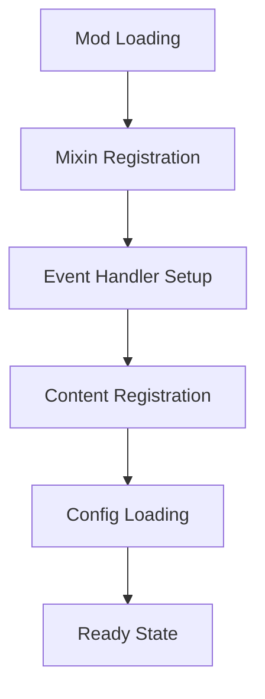
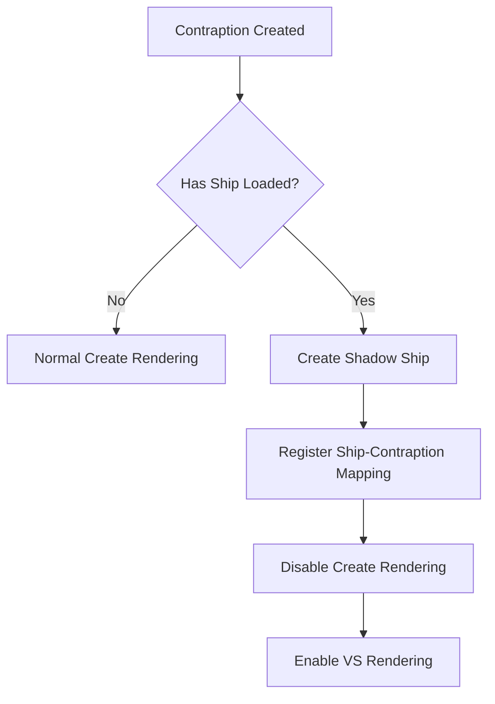
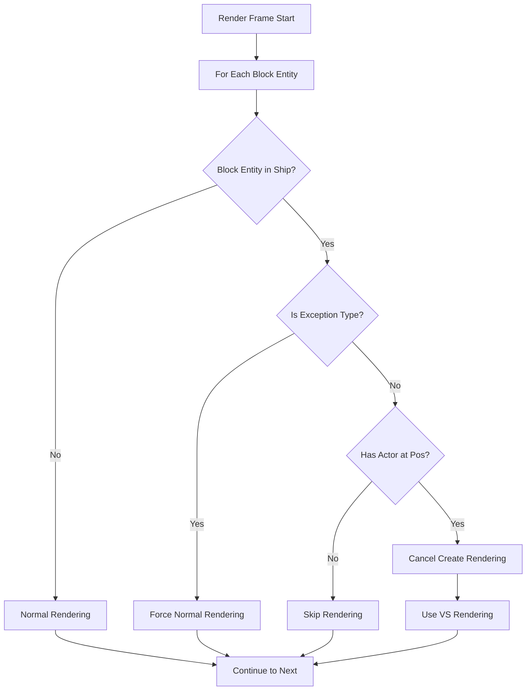
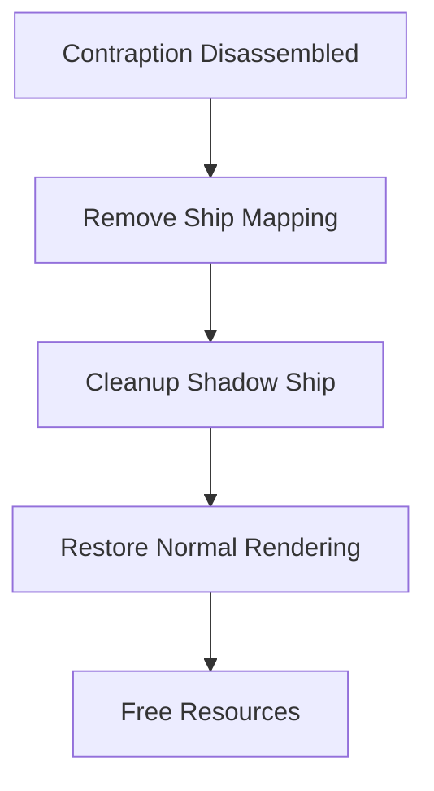

# Documentação Completa do Mod Create Interactive

## Índice
1. [Visão Geral](#visão-geral)
2. [Arquitetura do Mod](#arquitetura-do-mod)
3. [Sistema de Mixins](#sistema-de-mixins)
4. [Sistema de Renderização](#sistema-de-renderização)
5. [Integração Valkyrien Skies + Create](#integração-valkyrien-skies--create)
6. [Componentes Principais](#componentes-principais)
7. [Fluxo de Operação](#fluxo-de-operação)
8. [API e Interfaces](#api-e-interfaces)
9. [Configurações](#configurações)
10. [Resolução de Problemas](#resolução-de-problemas)

---

## Visão Geral

O **Create Interactive** é um mod de compatibilidade que integra o mod **Create** com o **Valkyrien Skies**, permitindo que contraptions (estruturas móveis do Create) funcionem adequadamente quando montadas em naves (ships) do Valkyrien Skies.

### Problema Resolvido
Quando contraptions do Create são colocadas em naves do Valkyrien Skies, ocorrem conflitos de renderização onde:
- Block entities são renderizados duas vezes (duplicação visual)
- Sistemas de renderização conflitam entre si
- Block entities complexos (como Little Tiles) não são exibidos corretamente
- Performance degradada devido à renderização redundante

### Solução Implementada
O mod usa um sistema de **mixins** para:
1. **Detectar** quando uma contraption está em uma nave
2. **Cancelar seletivamente** a renderização padrão do Create
3. **Transferir responsabilidade** de renderização para o Valkyrien Skies
4. **Manter funcionalidade** de componentes críticos

---

## Arquitetura do Mod

### Estrutura de Pacotes

```
org.valkyrienskies.create_interactive/
├── config/                    # Configurações do mod
├── content/                   # Blocos e itens customizados
├── mixin/                     # Mixins principais
│   ├── client/               # Mixins do lado cliente
│   ├── compat/               # Compatibilidade com outros mods
│   ├── bearing/              # Mixins específicos para bearings
│   ├── deployer/             # Mixins para deployers
│   └── ...
├── mixin_logic/              # Lógica dos mixins
│   ├── client/               # Lógica do lado cliente
│   └── ...
├── mixinducks/               # Interfaces para mixins
├── registry/                 # Registro de componentes
└── services/                 # Serviços do mod
```

### Padrão de Design

O mod utiliza o padrão **Mixin + Logic + Duck Interface**:

1. **Mixin Classes**: Interceptam métodos originais
2. **Logic Classes**: Contêm a lógica de negócio
3. **Duck Interfaces**: Adicionam novos métodos às classes existentes

---

## Sistema de Mixins

### Configuração de Mixins

O mod possui dois arquivos de configuração de mixins:

#### `create_interactive.mixins.json` (Forge)
```json
{
  "required": true,
  "package": "org.valkyrienskies.create_interactive.forge.mixin",
  "compatibilityLevel": "JAVA_17",
  "mixins": [
    "MixinCarriageEntityHandler",
    "MixinCombinedInvWrapper",
    "MixinCombinedTankWrapper",
    // ...
  ],
  "client": [
    "MixinContraptionHandlerClient"
  ]
}
```

#### `create_interactive-common.mixins.json` (Comum)
```json
{
  "required": true,
  "package": "org.valkyrienskies.create_interactive.mixin",
  "compatibilityLevel": "JAVA_17",
  "client": [
    "client.MixinBlockEntityRenderDispatcher",
    "client.MixinContraptionRenderDispatcher",
    "client.MixinContraptionInstanceManager",
    // ...
  ],
  "mixins": [
    "MixinContraption",
    "MixinAbstractContraptionEntity",
    // ...
  ]
}
```

### Mixins Principais

#### 1. MixinBlockEntityRenderDispatcher
**Propósito**: Controla a renderização individual de block entities

```java
@Mixin(value={BlockEntityRenderDispatcher.class})
public class MixinBlockEntityRenderDispatcher {
    @Inject(method={"render"}, at={@At(value="HEAD")}, cancellable=true)
    private <E extends BlockEntity> void preRender(E blockEntity, float partialTick, 
                                                   PoseStack poseStack, MultiBufferSource bufferSource, 
                                                   CallbackInfo ci) {
        // Cancela renderização se blockEntity estiver em nave
        MixinBlockEntityRenderDispatcherLogic.INSTANCE.preRender$create_interactive(blockEntity, ci);
    }
}
```

**Funcionamento**:
- Intercepta todas as chamadas de renderização de block entities
- Verifica se o block entity está em uma nave
- Cancela a renderização se necessário

#### 2. MixinContraptionRenderDispatcher
**Propósito**: Controla a renderização de contraptions inteiras

```java
@Mixin(value={ContraptionRenderDispatcher.class})
public class MixinContraptionRenderDispatcher {
    @Inject(method={"buildStructureBuffer"}, at={@At(value="HEAD")}, cancellable=true)
    private static void preBuildStructureBuffer(VirtualRenderWorld renderWorld, Contraption c, 
                                               RenderType layer, CallbackInfoReturnable<SuperByteBuffer> cir) {
        // Retorna buffer vazio se contraption estiver em nave
        MixinContraptionRenderDispatcherLogic.INSTANCE.preBuildStructureBuffer$create_interactive(renderWorld, c, layer, cir);
    }

    @Inject(method={"renderBlockEntities"}, at={@At(value="HEAD")}, cancellable=true)
    private static void preRenderBlockEntities(Level world, VirtualRenderWorld renderWorld, Contraption c, 
                                              ContraptionMatrices matrices, MultiBufferSource buffer, CallbackInfo ci) {
        // Cancela renderização de block entities da contraption
        MixinContraptionRenderDispatcherLogic.INSTANCE.preRenderBlockEntities$create_interactive(c, ci);
    }
}
```

#### 3. MixinContraptionInstanceManager
**Propósito**: Gerencia instâncias de renderização de contraptions

```java
@Mixin(value={ContraptionInstanceManager.class})
public abstract class MixinContraptionInstanceManager extends BlockEntityInstanceManager {
    @Overwrite
    public void beginFrame(@NotNull TaskEngine taskEngine, @NotNull Camera info) {
        if (!CreateInteractiveUtil.INSTANCE.doesContraptionHaveShipLoaded(this.contraption)) {
            // Renderização normal se não estiver em nave
            super.beginFrame(taskEngine, info);
        } else if (!this.ci$hasRemovedBlockEntities) {
            // Remove block entities para evitar renderização dupla
            for (BlockEntity be : this.contraption.maybeInstancedBlockEntities) {
                this.remove(be);
            }
            this.ci$hasRemovedBlockEntities = true;
        }
        // Mantém atores funcionando
        this.actors.forEach(ActorInstance::beginFrame);
    }
}
```

#### 4. MixinContraption
**Propósito**: Adiciona funcionalidades de rastreamento à classe Contraption

```java
@Mixin(value={Contraption.class})
public abstract class MixinContraption implements ContraptionDuck {
    @Unique
    private Set<BlockPos> ci$changedActors;
    
    // Implementa métodos da interface ContraptionDuck
    public boolean ci$hasActorAtPos(@NotNull BlockPos localPos) {
        return MixinContraptionLogic.INSTANCE.hasActorAtPos$create_interactive(localPos, this.actors);
    }
    
    public boolean ci$hasBogeyAtPos(@NotNull BlockPos localPos) {
        return MixinContraptionLogic.INSTANCE.hasBogeyAtPos$create_interactive(this.entity, localPos);
    }
    
    // ...outros métodos
}
```

---

## Sistema de Renderização

### Fluxo de Renderização Original vs. Modificado

#### Fluxo Original (Sem Create Interactive)
```
Minecraft Render Loop
├── World Rendering
├── Block Entity Rendering (BlockEntityRenderDispatcher)
│   ├── Create Contraption Rendering (ContraptionRenderDispatcher)
│   │   ├── Structure Buffer Building
│   │   └── Block Entity Rendering
│   └── Individual Block Entity Rendering
└── Valkyrien Skies Ship Rendering
    └── Ship-based Block Rendering
```

**Problema**: Renderização dupla e conflitos entre sistemas.

#### Fluxo Modificado (Com Create Interactive)
```
Minecraft Render Loop
├── World Rendering
├── Create Interactive Detection
│   ├── Ship Detection
│   └── Contraption Analysis
├── Conditional Rendering
│   ├── If NOT in Ship: Create Normal Rendering
│   └── If in Ship: Valkyrien Skies Rendering Only
└── Valkyrien Skies Ship Rendering
    └── Ship-based Block Rendering (inclui contraptions)
```

### Lógica de Detecção

#### Método Principal: `shouldRemoveBlockEntityInShip`

```java
public final boolean shouldRemoveBlockEntityInShip$create_interactive(@NotNull BlockEntity blockEntity) {
    // 1. Obter posição e nível do block entity
    Level level = blockEntity.getLevel();
    BlockPos pos = blockEntity.getBlockPos();
    
    // 2. Verificar se está em uma nave
    Ship ship = VSGameUtilsKt.getShipManagingPos(level, pos);
    if (ship == null) {
        return false; // Não está em nave, renderização normal
    }
    
    // 3. Obter contraption entity associada à nave
    WeakReference<AbstractContraptionEntity> weakReference = 
        CreateInteractiveUtil.INSTANCE.getShipIdToContraptionEntityClient().get(ship.getId());
    
    if (weakReference == null || weakReference.get() == null) {
        return false; // Sem contraption associada
    }
    
    AbstractContraptionEntity contraptionEntity = weakReference.get();
    
    // 4. Calcular posição relativa na contraption
    Vector3ic shipCenter = CreateInteractiveUtil.INSTANCE.getChunkClaimCenterPos(ship, level);
    BlockPos relativePos = pos.subtract(VectorConversionsMCKt.toBlockPos(shipCenter));
    
    // 5. Aplicar regras específicas por tipo
    if (blockEntity instanceof AbstractBogeyBlockEntity) {
        // Bogeys têm lógica especial
        ContraptionDuck contraptionDuck = (ContraptionDuck)contraptionEntity.getContraption();
        return contraptionDuck.ci$hasBogeyAtPos(relativePos);
    }
    
    // 6. Exceções: estes sempre renderizam normalmente
    if (blockEntity instanceof DeployerBlockEntity) return false;
    if (blockEntity instanceof SlidingDoorBlockEntity) return false;
    if (blockEntity instanceof MechanicalBearingBlockEntity) return false;
    
    // 7. Verificação final: está na lista de atores?
    ContraptionDuck contraptionDuck = (ContraptionDuck)contraptionEntity.getContraption();
    return contraptionDuck.ci$hasActorAtPos(relativePos);
}
```

#### Método de Verificação de Nave: `doesContraptionHaveShipLoaded`

```java
public final boolean doesContraptionHaveShipLoaded(@NotNull Contraption contraption) {
    // 1. Verificar se contraption tem entity
    AbstractContraptionEntity contraptionEntity = contraption.entity;
    if (contraptionEntity == null) {
        return false;
    }
    
    // 2. Obter ID da nave sombra
    Long shadowShipId = ((AbstractContraptionEntityDuck)contraptionEntity).ci$getShadowShipId();
    if (shadowShipId == null) {
        return false;
    }
    
    // 3. Verificar se a nave está carregada
    return VSGameUtilsKt.getShipObjectWorld(contraptionEntity.level())
        .getLoadedShips()
        .getById(shadowShipId) != null;
}
```

---

## Integração Valkyrien Skies + Create

### Sistema de Ship Shadows

O Create Interactive implementa um sistema de "naves sombra" que sincroniza contraptions com naves:

#### Mapeamento Ship ↔ Contraption
```java
// Mapas de sincronização (cliente e servidor)
private static final Map<Long, WeakReference<AbstractContraptionEntity>> 
    shipIdToContraptionEntityClientInternal = new HashMap();
private static final Map<Long, WeakReference<AbstractContraptionEntity>> 
    shipIdToContraptionEntityServerInternal = new HashMap();
```

#### Processo de Sincronização

1. **Criação da Contraption**:
   ```java
   @Inject(method={"onEntityCreated"}, at={@At(value="HEAD")}, remap=false)
   private void preOnEntityCreated(AbstractContraptionEntity entity, CallbackInfo ci) {
       // Criar nave sombra para a contraption
       MixinContraptionLogic.INSTANCE.preOnEntityCreated$create_interactive(this.blocks, entity);
   }
   ```

2. **Sincronização de Transformações**:
   - Posição da contraption → Posição da nave
   - Rotação da contraption → Rotação da nave
   - Velocidade da contraption → Velocidade da nave

3. **Cleanup de Recursos**:
   ```java
   @Inject(method={"addBlocksToWorld"}, at={@At(value="RETURN")})
   private void postAddBlocksToWorld(Level world, StructureTransform transform, CallbackInfo ci) {
       // Limpar recursos quando contraption é desmontada
       MixinContraptionLogic.INSTANCE.postAddBlocksToWorld$create_interactive(
           this.entity, this.blocks, world, transform);
   }
   ```

### Sistema de Atores

O mod implementa um sistema de rastreamento de "atores" (blocos funcionais) dentro das contraptions:

#### Interface ContraptionDuck
```java
public interface ContraptionDuck {
    void ci$setBlock(@NotNull BlockPos pos, @NotNull StructureTemplate.StructureBlockInfo blockInfo);
    boolean ci$hasActorAtPos(@NotNull BlockPos pos);
    boolean ci$hasBogeyAtPos(@NotNull BlockPos pos);
    Pair<StructureTemplate.StructureBlockInfo, MovementContext> ci$getActorAtPos(@NotNull BlockPos pos);
    Collection<BlockPos> ci$getChangedActors();
    void ci$clearChangedActors();
}
```

#### Detecção de Atores
```java
public final boolean hasActorAtPos$create_interactive(@NotNull BlockPos localPos, 
                                                     @NotNull List<? extends MutablePair<StructureTemplate.StructureBlockInfo, MovementContext>> actors) {
    // Verifica se existe um ator na posição especificada
    return actors.stream()
        .anyMatch(actor -> actor.left.pos().equals(localPos));
}
```

---

## Componentes Principais

### 1. CreateInteractiveUtil

**Propósito**: Classe utilitária central com funcionalidades principais.

#### Métodos Principais:

- **`doesContraptionHaveShipLoaded(Contraption)`**: Verifica se contraption tem nave carregada
- **`getChunkClaimCenterPos(Ship, Level)`**: Calcula centro de claim da nave
- **`hasInteractMeSticker(blocks)`**: Verifica presença do bloco "Interact Me"
- **`updateShipShadow(AbstractContraptionEntity)`**: Atualiza nave sombra
- **Gerenciamento de mapas ship ↔ contraption**

### 2. CreateInteractiveEventsClient

**Propósito**: Manipula eventos do lado cliente.

```java
public class CreateInteractiveEventsClient {
    public static void postTickClient(MinecraftClientApi client) {
        // Processa eventos pós-tick do cliente
        // Atualiza renderização
        // Sincroniza estado
    }
}
```

### 3. CreateInteractiveContraptionRotationState

**Propósito**: Gerencia estado de rotação sincronizado entre Create e Valkyrien Skies.

```java
public class CreateInteractiveContraptionRotationState {
    // Estado de rotação customizado
    // Sincronização entre sistemas
    // Interpolação de rotações
}
```

### 4. GameContent

**Propósito**: Define blocos e itens customizados do mod.

```java
public class GameContent {
    public static final DeferredRegister<Block> BLOCKS = // ...
    public static final RegistryObject<Block> INTERACT_ME = // ...
    public static final RegistryObject<Block> INTERACT_ME_NOT = // ...
    
    // Outros componentes de conteúdo
}
```

---

## Fluxo de Operação

### 1. Inicialização do Mod



### 2. Detecção de Contraption em Nave



### 3. Processo de Renderização



### 4. Cleanup de Contraption



---

## API e Interfaces

### Duck Interfaces

#### ContraptionDuck
Adiciona funcionalidades de rastreamento à classe Contraption:

```java
public interface ContraptionDuck {
    // Gestão de blocos
    void ci$setBlock(@NotNull BlockPos pos, @NotNull StructureTemplate.StructureBlockInfo blockInfo);
    
    // Verificação de atores
    boolean ci$hasActorAtPos(@NotNull BlockPos pos);
    Pair<StructureTemplate.StructureBlockInfo, MovementContext> ci$getActorAtPos(@NotNull BlockPos pos);
    
    // Verificação de bogeys
    boolean ci$hasBogeyAtPos(@NotNull BlockPos pos);
    
    // Rastreamento de mudanças
    Collection<BlockPos> ci$getChangedActors();
    void ci$clearChangedActors();
}
```

#### AbstractContraptionEntityDuck
Adiciona funcionalidades à entity de contraption:

```java
public interface AbstractContraptionEntityDuck {
    Long ci$getShadowShipId();
    void ci$setShadowShipId(Long shipId);
    
    // Outros métodos de sincronização
}
```

#### ContraptionInstanceManagerDuck
Gerencia instâncias de renderização:

```java
public interface ContraptionInstanceManagerDuck {
    void ci$deleteActorInstance(ActorInstance actorInstance);
    boolean ci$hasRemovedBlockEntities();
    void ci$setHasRemovedBlockEntities(boolean value);
}
```

### Configurações API

#### CreateInteractiveConfigs
```java
public class CreateInteractiveConfigs {
    public static class Client {
        public ConfigBool DISABLE_CONTRAPTION_ENTITY_RENDERING;
        public ConfigBool RENDER_CONTRAPTION_BLOCK_ENTITIES;
        // Outras configurações do cliente
    }
    
    public static class Common {
        public ConfigEnum<InteractiveHandling> INTERACTIVE_HANDLING;
        public ConfigBool ENABLE_SHIP_CREATION;
        // Outras configurações comuns
    }
}
```

#### InteractiveHandling (Enum)
```java
public enum InteractiveHandling {
    DISABLED,           // Desabilitado
    INTERACT_ME_ONLY,   // Apenas com bloco "Interact Me"
    SMART,              // Detecção inteligente
    ALL                 // Todas as contraptions
}
```

---

## Configurações

### Arquivo de Configuração

O mod utiliza um sistema de configuração hierárquico:

```java
// Configurações do Cliente
CreateInteractiveConfigs.CLIENT = new CreateInteractiveConfigs.Client();
CreateInteractiveConfigs.CLIENT.DISABLE_CONTRAPTION_ENTITY_RENDERING = new ConfigBool(true);
CreateInteractiveConfigs.CLIENT.RENDER_CONTRAPTION_BLOCK_ENTITIES = new ConfigBool(false);

// Configurações Comuns
CreateInteractiveConfigs.COMMON = new CreateInteractiveConfigs.Common();
CreateInteractiveConfigs.COMMON.INTERACTIVE_HANDLING = new ConfigEnum<>(InteractiveHandling.SMART);
CreateInteractiveConfigs.COMMON.ENABLE_SHIP_CREATION = new ConfigBool(true);
```

### Opções de Configuração

#### Cliente
- **DISABLE_CONTRAPTION_ENTITY_RENDERING**: Desabilita renderização de contraption entities
- **RENDER_CONTRAPTION_BLOCK_ENTITIES**: Controla renderização de block entities em contraptions
- **DEBUG_RENDERING**: Ativa modo de debug visual

#### Servidor/Comum
- **INTERACTIVE_HANDLING**: Define como contraptions se tornam interativas
  - `DISABLED`: Funcionalidade desabilitada
  - `INTERACT_ME_ONLY`: Apenas contraptions com bloco "Interact Me"
  - `SMART`: Detecção automática baseada em heurísticas
  - `ALL`: Todas as contraptions se tornam interativas
- **ENABLE_SHIP_CREATION**: Permite criação automática de naves
- **SHIP_SIZE_LIMIT`: Limite de tamanho para naves automáticas

---

## Resolução de Problemas

### Problemas Comuns

#### 1. Renderização Dupla
**Sintomas**: Blocos aparecem duas vezes, performance ruim
**Causa**: Conflito entre sistemas de renderização
**Solução**: Verificar configuração `DISABLE_CONTRAPTION_ENTITY_RENDERING`

#### 2. Blocos não Renderizam
**Sintomas**: Blocos invisíveis em contraptions
**Causa**: Renderização cancelada incorretamente
**Solução**: 
- Verificar se block entity está na lista de exceções
- Ajustar configuração `INTERACTIVE_HANDLING`

#### 3. Performance Degradada
**Sintomas**: FPS baixo ao redor de contraptions
**Causa**: Processamento excessivo de detecção
**Solução**: 
- Usar `INTERACT_ME_ONLY` mode
- Limitar tamanho de contraptions

#### 4. Incompatibilidade com Outros Mods
**Sintomas**: Crashes ou comportamento estranho
**Causa**: Conflitos de mixins
**Solução**: 
- Verificar ordem de carregamento
- Usar configuração `DISABLED` temporariamente

### Debug e Logging

#### Ativando Debug
```java
// Em desenvolvimento, adicionar:
System.setProperty("create_interactive.debug", "true");

// Logs detalhados de renderização
CreateInteractiveUtil.DEBUG_RENDERING = true;
```

#### Informações de Debug Úteis
- Ship ID ↔ Contraption Entity mapping
- Estado de renderização por block entity
- Performance metrics de detecção
- Estado de sincronização ship/contraption

### Ferramentas de Desenvolvimento

#### 1. Bloco "Interact Me"
- **Propósito**: Forçar contraption a se tornar interativa
- **Uso**: Colocar em qualquer lugar na contraption
- **Registry Name**: `create_interactive:interact_me`

#### 2. Bloco "Interact Me Not"
- **Propósito**: Impedir contraption de se tornar interativa
- **Uso**: Colocar em qualquer lugar na contraption
- **Registry Name**: `create_interactive:interact_me_not`

#### 3. Comandos de Debug (Futuros)
```
/create_interactive debug ships          # Lista naves ativas
/create_interactive debug contraptions   # Lista contraptions
/create_interactive debug mapping        # Mostra mapeamento ship↔contraption
/create_interactive reload config       # Recarrega configurações
```

---

## Conclusão

O Create Interactive é um mod complexo que resolve problemas fundamentais de compatibilidade entre Create e Valkyrien Skies através de:

1. **Sistema de Mixins Sofisticado**: Intercepta e modifica comportamentos de renderização
2. **Sincronização Ship-Contraption**: Mantém estado consistente entre sistemas
3. **Renderização Condicional**: Evita duplicação e conflitos
4. **API Extensível**: Permite customização e extensão
5. **Configuração Flexível**: Adapta-se a diferentes necessidades

O mod serve como exemplo excelente de como resolver problemas de compatibilidade entre mods complexos usando técnicas avançadas de modificação de bytecode e arquitetura bem estruturada.

---

## Recursos Adicionais

### Links Úteis
- [Valkyrien Skies 2 API](https://github.com/ValkyrienSkies/Valkyrien-Skies-2)
- [Create Mod](https://github.com/Creators-of-Create/Create)
- [Mixin Documentation](https://github.com/SpongePowered/Mixin)

### Contribuindo
Para contribuir com o desenvolvimento do Create Interactive:
1. Entender a arquitetura descrita nesta documentação
2. Configurar ambiente de desenvolvimento com Forge MDK
3. Testar mudanças com cenários complexos
4. Manter compatibilidade com versões suportadas dos mods base

### Suporte
Para reportar bugs ou solicitar features:
1. Verificar configurações conforme esta documentação
2. Incluir logs detalhados
3. Especificar versões exatas dos mods
4. Descrever passos para reproduzir o problema
